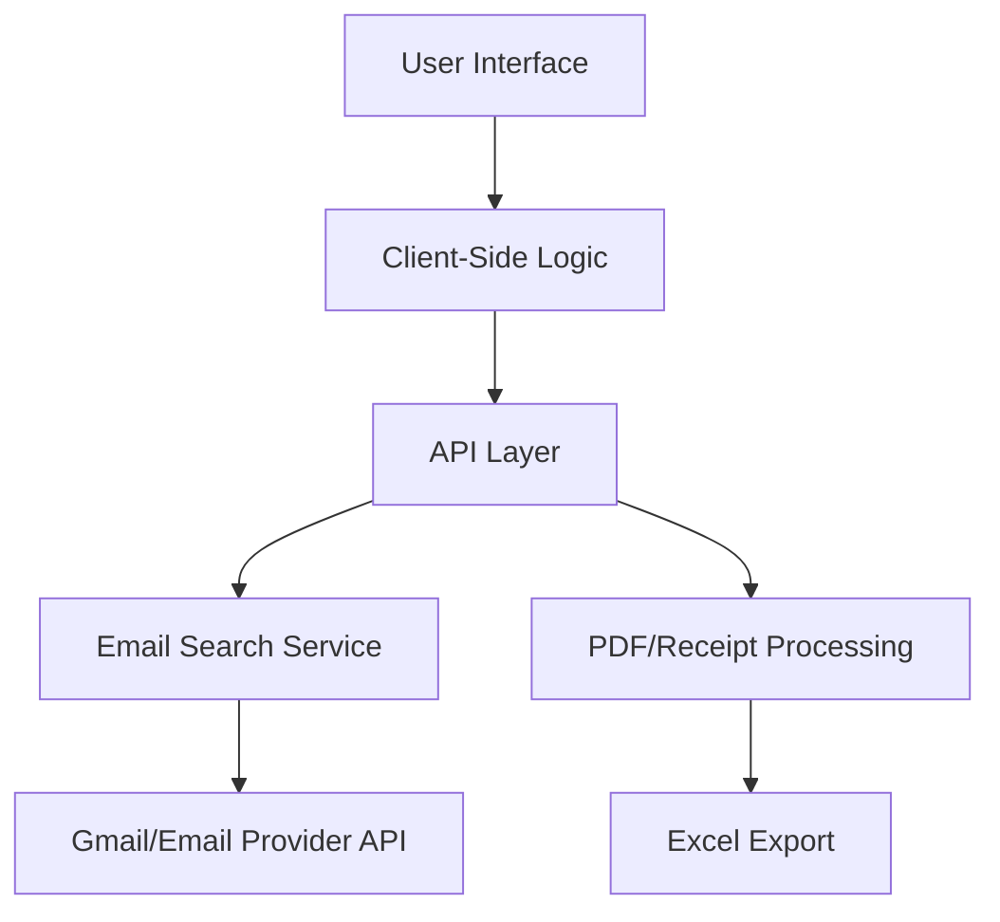

# Uber Receipt Dashboard Development Plan

## Overview

This plan outlines the development of an Uber receipt dashboard that allows users to:
- Search their email for Uber receipts within a specified date range
- Display results in a table format
- Delete rows from the table
- Download individual or bulk receipts
- Export data to Excel format

The application will use Next.js 15, Tailwind CSS, shadcn components, and Clerk for authentication.

## Package Manager

Use `pnpm` as the package manager for this project. To install dependencies:

```bash
pnpm install
```

To run the development server:

```bash
pnpm dev
```

## Architecture



## Iterative Development Plan

### Phase 1: Project Setup & Basic UI ✅

- [x] Create folder structure for receipts feature
  - [x] Create `src/app/receipts/` directory
  - [x] Create `src/app/receipts/page.tsx`
  - [x] Create `src/app/api/receipts/route.ts`

- [x] Create basic dashboard layout
  - [x] Header section with title
  - [x] Date range picker section
  - [x] Results table section
  - [x] Action buttons section

- [x] Implement date range selection
  - [x] Utilize existing Calendar component
  - [x] Create DateRangePicker component with start and end date
  - [x] Add form validation for date ranges

### Phase 2: Email Integration ✅

- [x] Create email search service
  - [x] Create API endpoint at `src/app/api/receipts/search/route.ts`
  - [x] Implement Gmail API integration (or other email provider)
  - [x] Add search query builder for Uber receipt emails
  - [x] Implement proper error handling

- [x] Create receipt parsing service
  - [x] Extract receipt data from email bodies
  - [x] Parse structured data from HTML emails
  - [x] Extract PDF attachments if available
  - [x] Create consistent data model for receipts

### Phase 3: Receipt Table Implementation ✅

- [x] Implement row selection
  - [x] Add checkboxes for selecting individual rows
  - [x] Add "Select All" functionality
  - [x] Store selected rows in state for bulk actions

- [x] Add row deletion functionality
  - [x] Create deletion dialog confirmation
  - [x] Implement client-side row removal
  - [x] Add visual feedback for successful deletion

### Phase 4: Download & Export Features ✅

- [x] Implement receipt download functionality
  - [x] Extract PDF links from emails 
  - [x] Add individual receipt download button
  - [x] Implement bulk download for selected receipts
  - [x] Add error handling for missing PDFs

- [x] Create Excel export service
  - [x] Design Excel template with appropriate formatting
  - [x] Create Excel generation service
  - [x] Implement export button functionality
  - [x] Add progress indicator for export process

### Phase 5: Optimization & Refinement
- [ ] Enhance user experience
  - [ ] Improve loading states and animations
  - [ ] Add helpful tooltips and instructions

- [ ] Add final polish
  - [ ] Ensure consistent styling with system theme
  - [ ] Add keyboard navigation support
  - [ ] Create helpful empty states for no results
  - [ ] Add comprehensive error messages

## UI Components

### Box Icons

Use Box Icons for all icons in the application. The CDN is already imported.

Example usage:

```jsx
<i className="bx bx-search"></i>
<i className="bx bxs-download"></i>
<i className="bx bx-trash"></i>
```

Common icons to use:
- `bx-search` - For search functionality
- `bxs-download` - For download buttons
- `bx-trash` - For deletion
- `bx-table` - For table views
- `bx-calendar` - For date-related components
- `bxs-file-export` - For export functionality

### Shadcn Components

Use shadcn components for UI elements. The command to install new components:

```bash
pnpm dlx shadcn@latest add [component-name]
```

Example:

```bash
pnpm dlx shadcn@latest add button
```

Currently installed components:
- button
- calendar
- dialog
- form
- input
- label
- popover
- select
- sonner
- table
- textarea

## Technical Considerations

1. **Email API Integration**:
   - Need to handle authentication flow for Gmail API
   - Consider rate limiting and throttling
   - Securely store access tokens with Clerk user metadata

3. **User Experience**:
   - Provide clear loading indicators for all async operations
   - Implement progressive enhancement for core functionality
   - Ensure accessibility compliance throughout

## Project Management

When a phase is completed, mark it as done by:
1. Adding a ✅ emoji next to the phase title
2. Changing all checkboxes from `[ ]` to `[x]` within that phase

## Testing Plan

Do not do testing as of now

## Potential Future Enhancements

- Advanced filtering options for receipts
- Data visualization for spending patterns
- Integration with expense tracking systems
- OCR for receipt data extraction from images
- Support for additional receipt types beyond Uber
